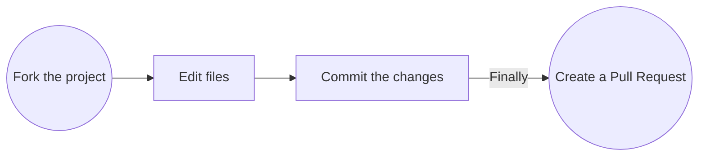

[](https://luarocks.org/modules/AMD-NICK/lua-express)

A minimalistic web framework for Lua. High-quality port of [express.js](https://github.com/expressjs/express/)

[](https://luarocks.org/modules/AMD-NICK/lua-express)
[](LICENSE)
[](https://github.com/TRIGONIM/lua-express/archive/refs/heads/master.zip)
[](https://hub.docker.com/r/defaced/lua-express)


```lua
local express = require("express")
local app = express()

app:get("/", function(_, res)
	res:send("Hello World!")
end)

app:listen(3000)
```

## Installation:

```bash
luarocks install lua-express
```

## Features:

- ✅ Same features as in the original express (except of rendering engine. temporarily) ➕
- 🪞 API implementation and similarity with express.js is almost 100%. Even in small details 🔥
- 🧩 Easy to embed into any existing lua applications of any complexity
- 🪶 Lowest possible amount of third-party dependencies
- 🚀 Asynchronous (non-blocking) processing of incoming requests
- 🛠️ Easy to extend and modify with third-party modules
- 🏋️‍♂️ Several highly loaded web applications are already running on lua-express right now

## Examples:

- 🍪 [Working with cookies](/examples/cookie.lua). Accessing a site with a secret cookie
- 🧠 [Advanced example](/examples/simple-advanced/README.MD). Working with routers, using middlewares, handling errors, displaying request information
- 🔗 [Client disconnection handler](/examples/disconnect_handler.lua). Simplest non-blocking implementation of client disconnection event

### 🌈 Extra:

- [Middlewares collection](https://github.com/TRIGONIM/lua-express-middlewares). Ready to use
- [Long Polling Server](https://github.com/TRIGONIM/lua-long-polling). One more app written in lua-express


## Dependencies

- [pegasus](https://github.com/EvandroLG/pegasus.lua) – minimalistic web server
- [luasocket](https://github.com/lunarmodules/luasocket) – shipped with pegasus
- [copas](https://github.com/lunarmodules/copas/) (optional in the feature) – non-blocking processing of incoming requests. Also useful to make mysql/redis/http-client libs asynchronous
- [cjson](https://luarocks.org/modules/openresty/lua-cjson) (optional. Only if the `res:json(obj)` function is required)


## Development:

<!-- original diagram source:
https://github.com/kishanrajput23/Hacktoberfest-2022/blob/main/README.md#steps-to-follow-scroll -->



```bash
luarocks install copas
luarocks install pegasus

# only for res:json(obj)
# luarocks install lua-cjson

# not sure if this is really needed
# luarocks install luasec

git clone https://github.com/TRIGONIM/lua-express && cd lua-express

# add local module path to LUA_PATH env
export LUA_PATH="$(pwd)/lua/?.lua;$(pwd)/lua/?/init.lua;$LUA_PATH"

# do what you want.
lua examples/cookie.lua

# commit and pull request
```
